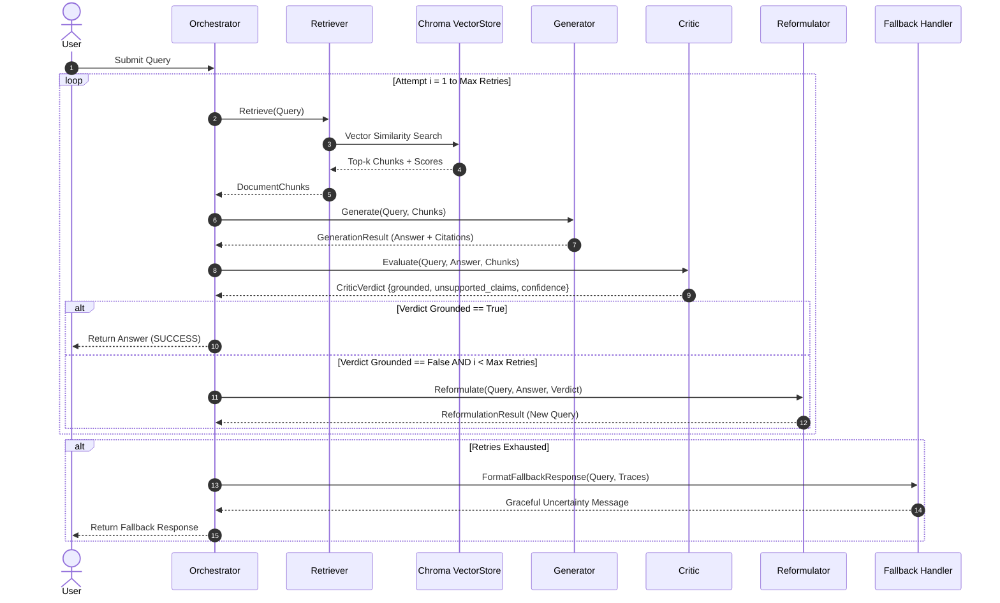

# Architecture & System Design — Self-Healing RAG

## Overview

Traditional Retrieval-Augmented Generation (RAG) pipelines operate in an open-loop manner: user queries are embedded, top-k chunks retrieved, and an LLM produces a single response. When retrieval fails or returns incomplete context, standard RAG suffers from **silent hallucination** or confident incorrect claims.

**Self-Healing RAG** closes this loop by introducing a stateful feedback cycle:
1. **Retrieve**: Vector search in ChromaDB using dense sentence-transformer embeddings.
2. **Generate**: Candidate response with explicit inline citation markers `[1]`, `[2]`.
3. **Critique**: An independent NLI/entailment evaluator inspects every claim against retrieved chunks and emits a structured JSON verdict (`grounded`, `unsupported_claims`, `confidence`, `reason`).
4. **Reformulate**: Upon rejection, a specialized Query Reformulator analyzes the critic's feedback to issue an optimized re-retrieval query.
5. **Fallback**: If retries are exhausted without achieving high-confidence grounding, the system gracefully falls back to an honest uncertainty message.

---

## State Machine Sequence



---

## Core Components

### 1. Vector Store (`vector_store.py`)
- **Abstract Interface**: `VectorStore` ABC allowing zero-code swap between local ChromaDB and cloud providers (Pinecone, Weaviate).
- **Embeddings**: `sentence-transformers/all-MiniLM-L6-v2` generating 384-dimensional dense vectors.
- **Distance Metric**: Cosine similarity normalized to `[0, 1]`.

### 2. Retriever (`retriever.py`)
- Extracts top-k relevant text passages matching the current query vector.
- Attaches rich metadata including source filename, chunk index, and similarity scores.

### 3. Generator (`generator.py`)
- Formats retrieved chunks into numbered context blocks (`Passage [1]`, `Passage [2]`).
- Prompts the LLM with strict instructions to include inline citation markers `[1]` matching source passages.
- Regex parser extracts cited indices and maps them back to parent chunk IDs.

### 4. Critic (`critic.py`)
- Acts as a zero-shot entailment judge.
- Enforces strict JSON schema validation for structured outputs:
  ```json
  {
    "grounded": false,
    "unsupported_claims": ["RSA 8192-bit keys are required"],
    "confidence": 0.95,
    "reason": "Context mentions TLS 1.3 but does not mention RSA 8192-bit keys."
  }
  ```
- Evaluates confidence scores against a configurable threshold (default `0.70`).

### 5. Query Reformulator (`reformulator.py`)
- Inspects the rejected answer, missing context elements, and specific unsupported claims.
- Generates a refined query targeting missing domain keywords or broadening/narrowing search terms.

### 6. Orchestrator (`orchestrator.py`)
- Manages loop execution state.
- Records full telemetry for every attempt (`AttemptTrace`), including query used, retrieved chunks, candidate answers, critic verdicts, and reformulation reasoning.
- Exports complete execution traces for API consumers and interactive frontends.

---

## Data Models (`schemas.py`)

- `DocumentChunk`: Text content, metadata, similarity score.
- `Citation`: 1-based index, chunk ID, source, text snippet.
- `GenerationResult`: Raw answer text + list of citations.
- `CriticVerdict`: Grounded boolean, list of unsupported claims, confidence score, reason.
- `ReformulationResult`: Original query, reformulated query, reasoning.
- `AttemptTrace`: Complete snapshot of attempt state and execution status.
- `PipelineResponse`: Final answer, status (`SUCCESS_FIRST_TRY`, `HEALED_AFTER_RETRY`, `FALLBACK`), total attempts, total execution time, and full attempt traces.
