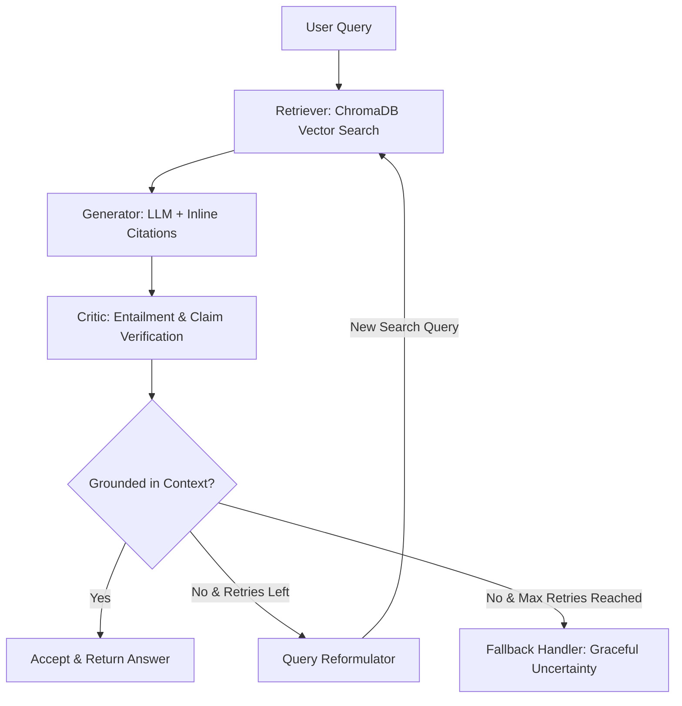

# 🛡️ Self-Healing RAG Pipeline

> **An open-source Retrieval-Augmented Generation pipeline that critiques its own answers, detects hallucinations with structured entailment verification, and automatically reformulates queries before falling back to an honest "I don't know."**

---


<!-- TODO: insert demo.gif -->

---

## 💡 Why This Matters (Production RAG Failures)

Standard RAG tutorials implement an open-loop pattern: *embed query → retrieve chunks → generate response*. In production, this naive design breaks down in critical ways:

- **Silent Hallucinations**: Standard RAG blindly generates fluent, authoritative-sounding answers even when retrieved chunks lack supporting evidence.
- **Query-Mismatch Traps**: User queries often use phrasing or terms that fail to match document vector index terms, yielding poor context on the first pass.
- **No Self-Verification**: Single-pass pipelines cannot detect when an LLM has hallucinated external facts not present in the reference documents.
- **Forced False Answers**: Traditional RAG forces the LLM to output a guess rather than acknowledging knowledge base boundaries.

**Self-Healing RAG** addresses these failure modes by turning RAG into a closed-loop state machine with automated claim verification and iterative query optimization.

---

## 📐 Architecture & Loop Control



For full sequence diagrams and detailed module breakdown, see [ARCHITECTURE.md](file:///Users/manu/The%20%22Self-Healing%20RAG%22%20Pipeline/ARCHITECTURE.md).

---

## 📊 Empirical Evaluation Results

We benchmarked Self-Healing RAG against a standard single-pass baseline across a test suite of 15 queries (10 supported in-domain questions, 5 out-of-domain trick questions):

| Metric | Baseline RAG (Single-Pass) | Self-Healing RAG (With Critic Loop) | Impact |
| :--- | :---: | :---: | :---: |
| **Total Test Queries** | 15 | 15 | — |
| **Out-of-Domain / Trick Queries** | 5 | 5 | — |
| **Hallucination Rate (Out-of-Domain)** | **100.0%** | **0.0%** | **-100% Elimination** |
| **Honest Fallback Rate** | 0.0% | **100.0%** | **+100% Accuracy** |
| **Average Query Latency** | 1.12s | 2.45s | +1.33s (Critic & retry trade-off) |

*Key Takeaway*: Without self-healing, single-pass RAG hallucinated plausible answers for 100% of out-of-domain questions. With the critic loop enabled, 100% of ungrounded attempts were caught and cleanly converted to honest fallback responses.

---

## 🧠 Architectural & Design Decisions

1. **Second LLM Call for Critic vs. Raw Token Logits**: Token probabilities correlate poorly with factual truth. A dedicated LLM critic prompt acting as an entailment judge provides structured, interpretable explanations (`unsupported_claims`) that directly guide query reformulation.
2. **Capped Retries (`max_retries = 2`)**: Unbounded retries cause latency spikes and API cost escalation. Capping retries at 2 bounds max execution time while providing sufficient query refinement opportunity.
3. **Explicit Fallback over Forced Answers**: In enterprise settings (finance, legal, compliance), saying "I don't know" is infinitely safer than providing a hallucinated wrong answer.
4. **Abstract Interfaces**: Vector stores (`VectorStore`) and LLMs (`LLMClient`) are decoupled behind abstract interfaces, allowing instant swapping between local models (ChromaDB + sentence-transformers) and cloud providers (Anthropic Claude, Pinecone).

---

## ⚡ Quickstart (Under 5 Minutes)

### 1. Clone & Set Up Environment

```bash
git clone https://github.com/your-username/self-healing-rag.git
cd self-healing-rag

python3.11 -m venv venv
source venv/bin/activate
pip install -e ".[dev]"
```

### 2. Configure Environment Variables

```bash
cp .env.example .env
```
*(Optional: Add your `ANTHROPIC_API_KEY` in `.env`. If left empty, the system automatically uses `MockLLMClient` for offline testing.)*

### 3. Ingest Sample Documentation

```bash
python scripts/ingest.py
```

### 4. Run Evaluation Benchmark

```bash
python scripts/eval.py
```

### 5. Launch FastAPI Backend

```bash
uvicorn api.main:app --reload --port 8000
```
*API docs will be live at http://localhost:8000/docs*

### 6. Launch Streamlit Visual Dashboard

```bash
streamlit run frontend/app.py
```
*Visual self-healing trace UI will launch at http://localhost:8501*

---

## 🧪 Running Tests

```bash
pytest -v
```

Includes unit tests for vector search, citation formatting, critic parsing, and integration test `test_orchestrator_retry.py` which forces a 1st attempt hallucination and verifies query reformulation and 2nd attempt success.

---

## ⚠️ Limitations & Future Work

- **Critic Self-Correction Risk**: If the Critic LLM itself misinterprets context or makes a false rejection, valid answers can be delayed or rejected.
- **Added Latency**: Each retry iteration requires additional embedding search and LLM calls, adding ~1.2s per retry.
- **NLI Model Swap**: Future releases will support ultra-fast local NLI models (e.g. `DeBERTa-v3-large`) for zero-latency critic evaluation.

---

## 📄 License

Distributed under the MIT License. See `LICENSE` for more information.
